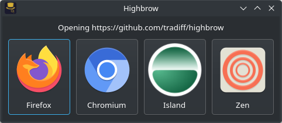

# Browser Fork

A simple browser chooser for Linux with configurable rules to automatically route web URLs to different browsers.



## Features

- Rules-based URL routing: Automatically open URLs in specific browsers based on regex patterns
- Browser selector: When no rule matches, use the simple UI to choose the browser

## Getting Started

1. Clone the repository:
```sh
git clone https://github.com/tradiff/browser-fork.git
cd browser-fork
```

2. Build in release mode:

```sh
cargo build --release
```

3. Run once to set Browser Fork as your default browser:

```sh
target/release/browser-fork
```

Use the UI prompt to set Browser Fork as your default browser.

## Configuration
Create a configuration file at `~/.config/browser-fork.toml` with the following structure:

```toml
[[browsers]]
label = "_Firefox" # Underscore prefix creates the keyboard shortcut Alt+f
command = "firefox" # Command to launch the browser
icon_name = "firefox" # System icon name
patterns = [
    'https://facebook\.com/.*',
    'https://spotify\.com/.*',
]

[[browsers]]
label = "_Chromium"
command = "chromium-browser"
icon_name = "chromium"
patterns = [
    'https://mycompany\.com/.*',
]
```

- **label**: Browser name shown in the selector UI. Prefix a letter with underscore (_) to create an Alt+Key keyboard shortcut.
- **command**: The executable command to launch the browser. You can include arguments (e.g. `firefox --private-window` or `firefox -P personal`)
- **icon_name**: The system icon name from your icon theme.
- **patterns**: List of regular expressions to match URLs. When a URL matches a pattern, it automatically opens in the corresponding browser. Any URLs that do not match a rule will display the selection UI.

### Example patterns

```toml
patterns = [
    # Match exact domain
    'https://example\.com(/.*)?',
    
    # Match http or https, and any subdomains
    'https?://(.*\.)?example\.com(/.*)?',
]
```